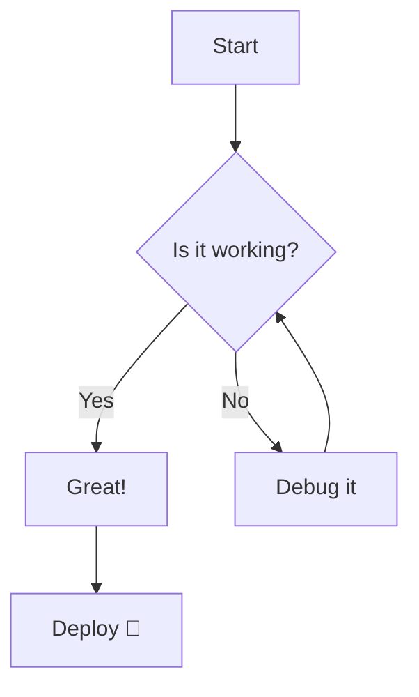
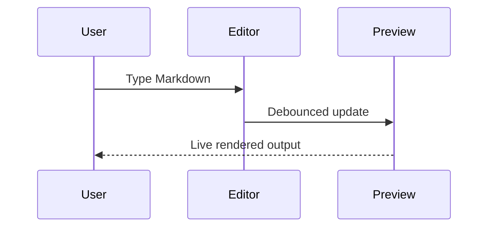

# Markdown Studio — Feature Demo

Welcome to **Markdown Studio** 🎉  
A feature-rich Markdown editor with live preview, multiple render themes, and export to PDF.

---

## 📝 Basic Formatting

**Bold text**, *italic text*, ~~strikethrough~~, `inline code`, and ==highlighted== (GFM supported).

You can also write [hyperlinks](https://github.com) and include images.

---

## 📊 Tables (GFM)

| Feature | GitHub | VSCode | Obsidian |
|---------|--------|--------|----------|
| Dark mode | ❌ | ✅ | ✅ |
| Purple accent | ❌ | ❌ | ✅ |
| Code highlight | ✅ | ✅ | ✅ |
| Math support | ✅ | ✅ | ✅ |

---

## ✅ Task Lists

- [x] Set up Vite + React project
- [x] Implement three render themes
- [x] Add math (KaTeX) support
- [x] Add Mermaid diagram support
- [ ] Deploy to GitHub Pages

---

## 🔢 Math (KaTeX)

### Inline Math

Einstein's famous equation: $E = mc^2$

The quadratic formula: $x = \dfrac{-b \pm \sqrt{b^2 - 4ac}}{2a}$

### Block Math

$$
\int_{-\infty}^{\infty} e^{-x^2} \, dx = \sqrt{\pi}
$$

$$
\nabla \cdot \mathbf{E} = \frac{\rho}{\varepsilon_0} \qquad
\nabla \times \mathbf{B} = \mu_0 \mathbf{J} + \mu_0 \varepsilon_0 \frac{\partial \mathbf{E}}{\partial t}
$$

$$
F(x) = \sum_{n=0}^{\infty} \frac{f^{(n)}(a)}{n!}(x-a)^n
$$

---

## 📈 Diagrams (Mermaid)

### Flowchart



### Sequence Diagram



---

## 💻 Code Blocks

### JavaScript

```javascript
const greet = (name) => {
  const message = `Hello, ${name}! 👋`;
  console.log(message);
  return message;
};

greet('Markdown Studio');
```

### Python

```python
def fibonacci(n: int) -> list[int]:
    seq = [0, 1]
    for _ in range(n - 2):
        seq.append(seq[-1] + seq[-2])
    return seq[:n]

print(fibonacci(10))
```

### SQL

```sql
SELECT
    u.name,
    COUNT(p.id) AS post_count,
    AVG(p.likes) AS avg_likes
FROM users u
LEFT JOIN posts p ON u.id = p.user_id
GROUP BY u.id
ORDER BY post_count DESC
LIMIT 10;
```

---

## 💬 Blockquotes

> "The best way to predict the future is to invent it."  
> — *Alan Kay*

> [!NOTE]  
> This is a GitHub-flavored alert blockquote.

---

## 📌 Footnotes

Markdown Studio supports footnotes[^1] via the remark-footnotes plugin[^2].

[^1]: A footnote is a note placed at the bottom of a page.
[^2]: See [remark-footnotes](https://github.com/remarkjs/remark-footnotes) for more details.

---

## 🔤 Typography Showcase

# Heading 1
## Heading 2
### Heading 3
#### Heading 4
##### Heading 5

A horizontal rule:

---

An ordered list:

1. First item
2. Second item
   1. Nested item A
   2. Nested item B
3. Third item

An unordered list:

- Item one
- Item two
  - Nested item
  - Another nested item
- Item three

---

*Switch themes using the toolbar above to see how each render style transforms this document!*
